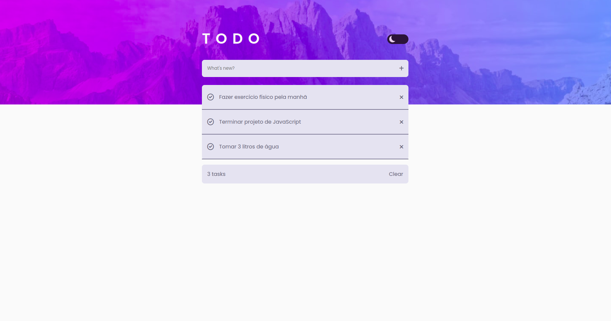
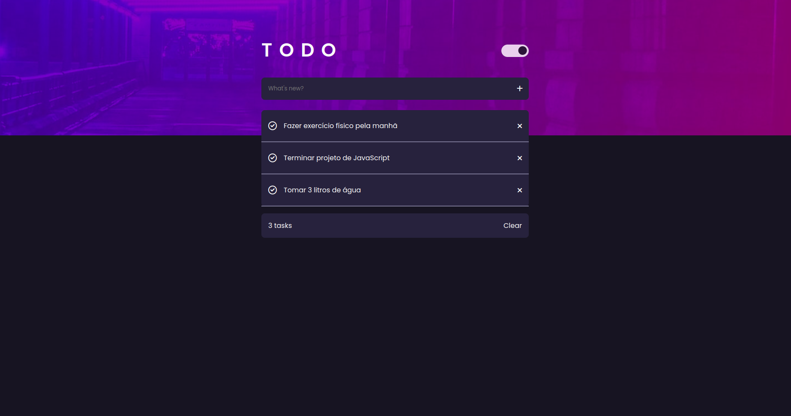

<h1 align="center"> To-do list 📃 </h1>

## Descrição ✏️

  A aplicação representa uma lista de tarefas, onde o usuário pode adicionar as tarefas a serem realizadas e remover as tarefas já concluídas. Também conta com um toggle entre light e dark mode, e um prefers-color-scheme, onde a página capta a preferência do usuário, e altera seu tema de acordo.

## Preview 🔎

  
  

## Tecnologias ⚒️

O projeto foi desenvolvido com as seguintes tecnologias:

- HTML
- CSS
- JavaScript
- DOM
- Git e GitHub

## Recursos adicionais 💡

  Além de armazenar as tarefas na localStorage, permitindo o usuário recarregar a página e não perder o conteúdo inserido, ao remover as tarefas a localStorage também é atualizada. Esse projeto permitiu que eu adquirisse um conhecimento em como fazer um toggle para a troca de temas e também como captar a preferência padrão de tema do usuário.

